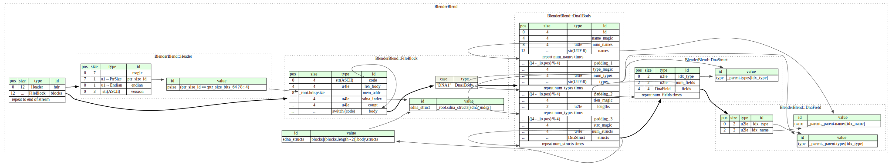

# VL.BlenderUtils
Blender Utils collection 

Blender Camera Parser & BlenderCameraFromFile

Blender

1. Open a new text editor (text block)
2. Press "Text/Open.." from the text editor menu
3. Go to [your_vl_repos_folder]/VL.BlenderUtils/help/assets/scripts
4. Choose and load the ExportBlenderCameraToVL.py
5. Select the camera you want to "export" from the viewport or the outliner
6. Execute the loaded script
7. Your result will be outputed in the console =>
	a. Blender's main menu "Window/Toggle System Console"

VL

1. move VL.BlenderUtils in your vl repositories
2. add VL.BlenderUtils as a dependency into your VL patch
3. Introduce a BlenderCameraParser
4. Create a String IOBox and paste the XML content

[Blender Block - Kaitai.io](/imgs/kaitai_blender_blend.svg)

# References

[The Mystery of the Blend](https://github.com/fschutt/mystery-of-the-blend-backup)

[Blender DNA: Unraveling the Internal Structure](https://harlepengren.com/blender-dna-unraveling-the-internal-structure/)

[Mystery of the Blend](https://projects.blender.org/blender/blender/src/branch/main/doc/blender_file_format/mystery_of_the_blend.html)

[Kaitai Blend File Structure](https://formats.kaitai.io/blender_blend/csharp.html)