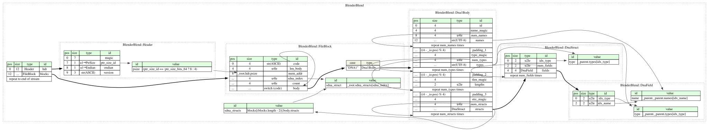

# VL.BlenderUtils

<!--

Blender Utils collection 

 
Blender Camera Parser & BlenderCameraFromFile

Blender

1. Open a new text editor (text block)
2. Press "Text/Open.." from the text editor menu
3. Go to [your_vl_repos_folder]/VL.BlenderUtils/help/assets/scripts
4. Choose and load the ExportBlenderCameraToVL.py
5. Select the camera you want to "export" from the viewport or the outliner
6. Execute the loaded script
7. Your result will be outputed in the console =>
	a. Blender's main menu "Window/Toggle System Console"

VL

1. move VL.BlenderUtils in your vl repositories
2. add VL.BlenderUtils as a dependency into your VL patch
3. Introduce a BlenderCameraParser
4. Create a String IOBox and paste the XML content
-->

## Blend File Parser for vvvv (gamma)

Blender is a well known 3D Software, free and open source. This vvvv library is an attempt to identify and reveal its "mystery" -as it is used to be said- of its files' structure.

I visited many sources I found online, best one so far was Kaitai site, they already have a working Parser, it is up to date and probably works nicely, although my itention was to built it from scratch I followed there examples and some of their solutions.

Nonetheless best source so far, is a script written in python at [official Blender github repo](https://github.com/blender/blender/blob/main/doc/blender_file_format/BlendFileReader.py), although it seems that it was buggy and hence I had to address a new question regarding the byte padding on [StackOverflow](https://stackoverflow.com/questions/79561711/alignment-is-wrong-when-trying-to-get-offset-while-parsing-blender-file-v4-4/79563536#79563536).

//TODO create table with types and their equivalent in C# implementation

//TODO present different types

---------------
### Notes

Using IntPtr is already good enough to read bytes properly (according endianess)
however this must change and be replaced by static functions in order to maintain the concept of working same files on 32 and 64 bit machines.

(needs to create a table with types)

----------------

[Blender Block - Kaitai.io](/imgs/kaitai_blender_blend.svg)

# References

[Makes DNA](https://github.com/blender/blender/tree/main/source/blender/makesdna)

[The Mystery of the Blend](https://github.com/fschutt/mystery-of-the-blend-backup)

[Blender DNA: Unraveling the Internal Structure](https://harlepengren.com/blender-dna-unraveling-the-internal-structure/)

[Mystery of the Blend](https://projects.blender.org/blender/blender/src/branch/main/doc/blender_file_format/mystery_of_the_blend.html)

[Kaitai Blend File Structure](https://formats.kaitai.io/blender_blend/csharp.html)

[ID Datablocks - Official Documentation](https://developer.blender.org/docs/features/core/datablocks/id_type/)

### Additional

[Blender Headless - Arguments](https://docs.blender.org/manual/en/latest/advanced/command_line/arguments.html)